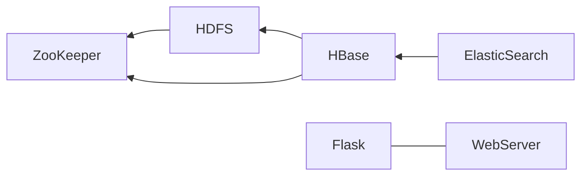

# UstcWebsiteHBase

## 实验目标

从科大的网站爬取文件数据，存在分布式数据库中(HBase)，做一个搜索引擎，实现校内文件搜索的目的。

## 技术栈

### 爬虫

我们爬取了以下八个网站共450条数据。

| 网站                       | 网址                                 |
| -------------------------- | ------------------------------------ |
| 大数据学院                 | http://sds.ustc.edu.cn/main.htm      |
| 中科大软件学院             | https://sse.ustc.edu.cn/main.htm     |
| 中科大苏州高等研究院       | https://sz.ustc.edu.cn/index.html    |
| 中科大信息科学技术学院     | https://sist.ustc.edu.cn/main.htm    |
| 中科大网络空间安全学院     | http://cybersec.ustc.edu.cn/main.htm |
| 中科大计算机科学与技术学院 | http://cs.ustc.edu.cn/main.htm       |
| 中科大财务处               | https://finance.ustc.edu.cn/main.htm |
| 国合部                     | https://oic.ustc.edu.cn              |

### Hbase

HBase 是一个高可靠性、高性能、面向列、可伸缩的分布式存储系统，利用 HBASE 技术可在廉价 PC Server 上搭建起大规模结构化存储集群。HBase 的目标是存储并处理大型的数据，更具体来说是仅需使用普通的硬件配置，就能够处理由成千上万的行和列所组成的大型数据。

### ElasticSearch

Elasticsearch 是一个分布式、RESTful 风格、基于 Lucene 库的开源搜索和数据分析引擎。在本项目中，我们采用ElasticSearch对hbase中的数据建立索引。ElasticSearch运行在本地的9200端口上。

由于我们的数据库中只含有title、date、url三列以及时间与精力的限制，我们选择title字段建立索引。

为了创建索引，ES引擎通过分词器将每个文档的内容拆成单独的词（称之为词条，或term），再将这些词条创建成不含重复词条的排序列表，然后列出每个词条出现在哪个文档。ES内置的分词器常用的分别为**Standard**（ES默认分词器，按单词分类并进行小写处理）与**Keyword**（不进行分词，作为一个整体输出），在尝试过后，结果不太理想。原因在于我们的项目中title绝大部分都是中文，而中文分词有特定的难点，不像英文，单词有自然的空格作为分隔，在中文句子中，不能简单地切分成一个个的字，而是需要分成有含义的词，但是在不同的上下文，是有不同的理解的。

于是我们加入中文分词器ik插件对中文分词进行针对性建立索引。

#### Kibana

Kibana 是 Elasticsearch 的 Web 界面，允许可视化存储在 Elasticsearch 索引中的数据。 它提供了各种图表类型、地图和表格。通过结合使用 Elasticsearch 和 Kibana，可以高效地存储、搜索和可视化大型数据集。 Elasticsearch 充当数据存储和搜索的支柱，而 Kibana 提供数据可视化和探索的界面。在我们的项目中，虽然kibana在最终的展示阶段未有出现，但在项目构建过程中对我们帮助十分巨大。

kibana运行在本地5601端口上。kibana作为 Elasticsearch 的图形化界面，在使用时可以通过Management栏对已经创建的index进行查看与管理，同样，在Dev Tools栏中，我们还可以直接使用索引创建代码创建所需要的索引，这也是我们尝试建立索引与观察后端query是否能查询成功的有力协作者。

### WebServer

为实现搜索引擎的可视化搜索功能，我们使用 Flask 作为 Web 框架和 Elasticsearch Python 客户端来与 Elasticsearch 服务器交互，在端口5000创建了一个简单的 Web 界面。用于使用不同类型的查询（fuzzy、reg、multi、showall）搜索 Elasticsearch 索引并向用户显示结果。 