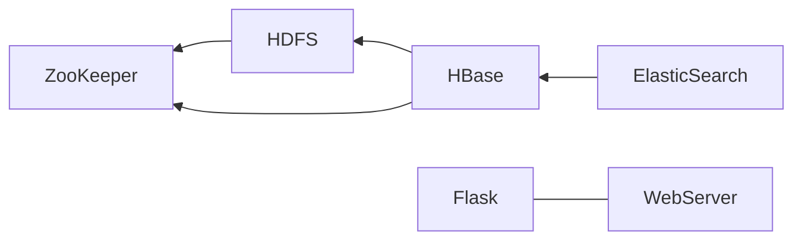

## 架构

```mermaid
flowchart RL
    HDFS --> ZooKeeper
    HBase --> ZooKeeper
    HBase --> HDFS
    ElasticSearch --> HBase
    WebServer --- Flask
```

## 

## 分工

任子骏：爬，ElasticSearch + Kibana，部分Web前端+后端

潘逸轩：Hadoop相关环境配置，部分Web前端+后端

## anything else?

